  

# Nexa Group

**Nexa Group** é uma **fábrica de software** especializada em desenvolver **soluções digitais inovadoras** com foco em **mercado financeiro e finanças pessoais**.  
Nossa missão é **resolver problemas reais com agilidade, qualidade e tecnologia de ponta**, entregando produtos que unem performance, design e valor estratégico.

---

## 💡 Quem Somos

Na Nexa Group, acreditamos que a tecnologia deve **simplificar o complexo e potencializar resultados**.  
Trabalhamos para transformar ideias em produtos digitais sólidos, escaláveis e centrados no usuário, aplicando as melhores práticas do mercado e as tendências mais recentes em **inteligência artificial**, **automação** e **experiência do usuário**.

Somos uma startup construída sobre três pilares fundamentais:
- **Inovação** como essência.  
- **Agilidade** como método.  
- **Excelência** como resultado.

---

## 👥 Liderança e Estrutura

A Nexa Group é composta por profissionais dedicados, com papéis estratégicos bem definidos:

- **Pedro Henrique Santana** — *Liderança Estratégica e Visão de Produto*  
- **Bruno César** — *CTO (Chief Technology Officer)*  
- **Marcos De Lima** — *Head de Inovação*  

Essa estrutura garante equilíbrio entre **gestão de produto, tecnologia e inovação**, resultando em entregas consistentes e de alto impacto.

---

## 🧠 Nossa Filosofia

> “Não criamos apenas software — criamos soluções que resolvem, conectam e evoluem com o tempo.”

A Nexa Group se baseia nas **melhores soluções e práticas globais**, principalmente no campo da **IA e automação inteligente**, para entregar produtos modernos, seguros e acessíveis.  
Nosso compromisso é oferecer **valor real por um preço justo**, mantendo sempre o foco na necessidade e satisfação do cliente.

---

## ⚙️ Áreas de Atuação

- Desenvolvimento de **aplicativos mobile e web**.  
- Soluções de **gestão e automação financeira**.  
- **Integrações inteligentes** com APIs e sistemas de terceiros.  
- Aplicação de **IA e análise de dados** para suporte a decisões.  
- Consultoria em **transformação digital e arquitetura de software**.  

---

## 📱 Produto em Destaque — Nexa App

  <!-- Texto -->
  

  O **Nexa** é o produto principal da Nexa Group: uma **plataforma de gestão financeira pessoal** desenvolvida para ajudar usuários a **organizar suas finanças, acompanhar ganhos e controlar investimentos** de forma simples, segura e intuitiva.

  O projeto está sendo construído com base em tecnologias modernas, como **Go (Fiber)** no backend e **React** no frontend, e segue o objetivo de entregar um **MVP funcional até novembro de 2025**.

  🧾 Termo de Anuência: [Acesse no Google Docs](https://docs.google.com/document/d/1b7rr_W3e6ecN7ZVXyZC4E3Qc2bcXIvdSlfa4_1rpiIk/edit?usp=sharing)

  📘 Saiba mais sobre o Nexa App em seu repositório dedicado:  
  [📂 Acesse o Repositório Frontend do Nexa](https://github.com/Nexa-Partners/nexa-finance-frontend)
  

  <!-- Imagem -->
  

    
  

---

## 🌍 Nossa Visão

Ser reconhecida como uma **referência em inovação e eficiência** no desenvolvimento de soluções digitais voltadas ao mercado financeiro, contribuindo para a **educação e autonomia financeira** das pessoas e organizações.

---

## 📫 Contato

Entre em contato conosco para parcerias, projetos e colaborações:  
✉️ **contato@nexagroup.com**  
🌐 [nexagroup.com](#) *(em breve)*  

---

> © 2025 Nexa Group — Inovação, eficiência e tecnologia a serviço das finanças.
